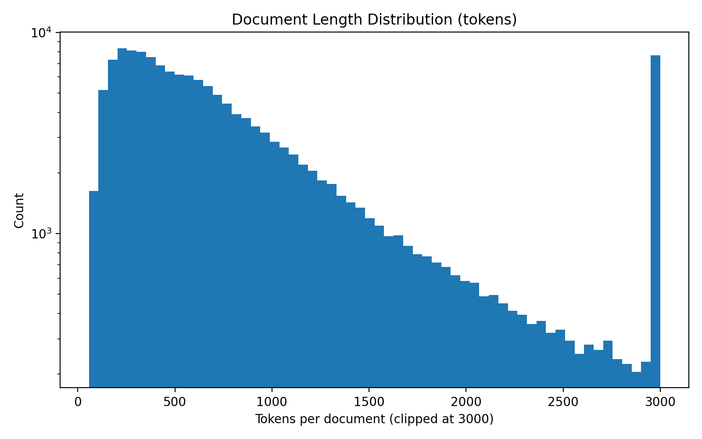
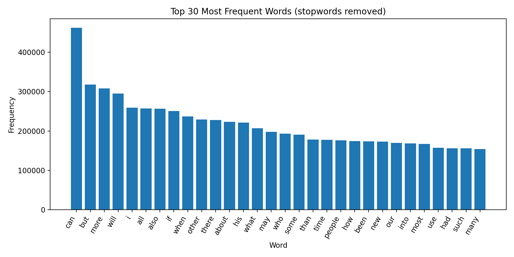
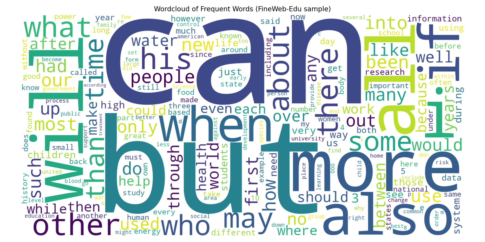
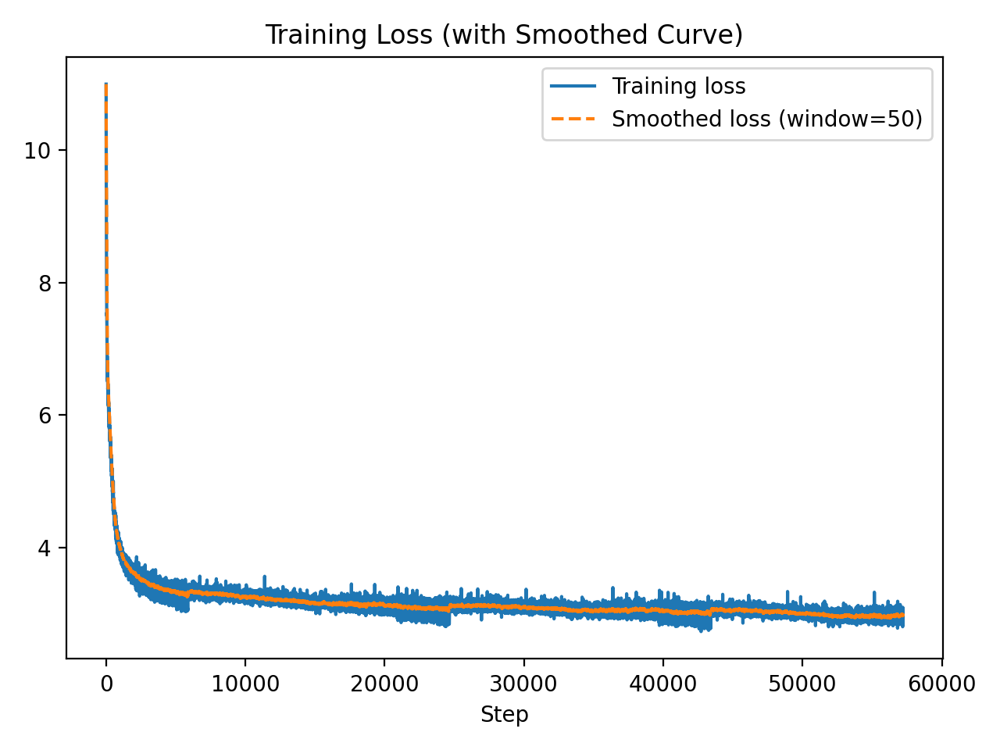
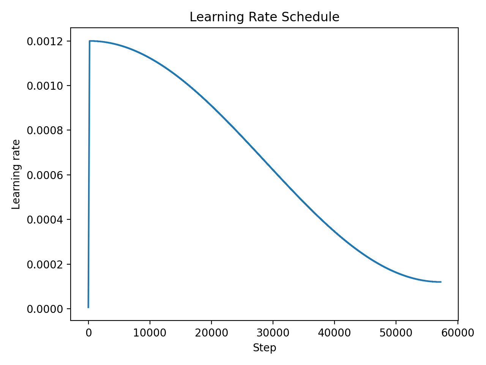
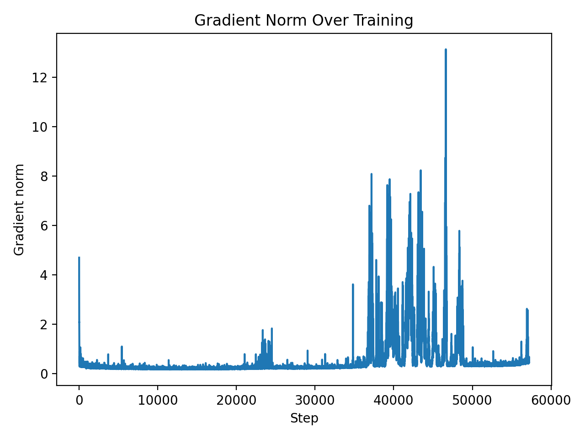
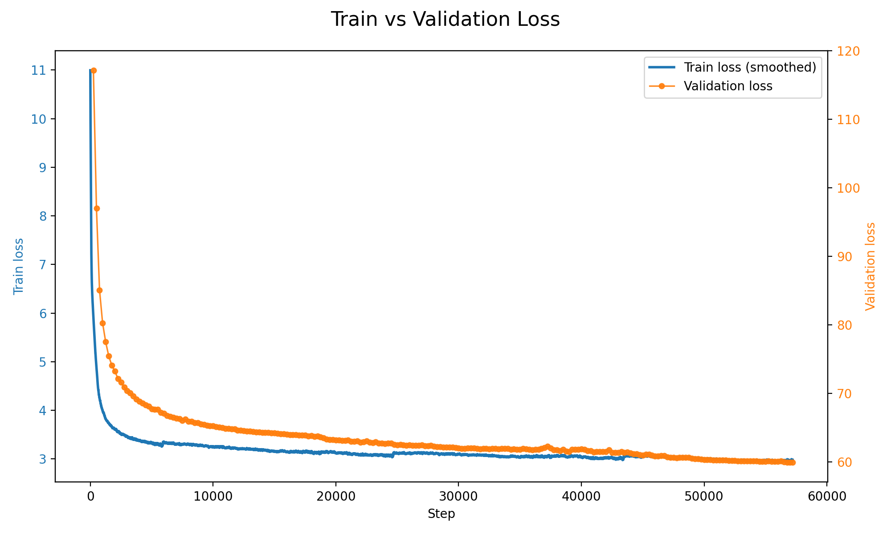

# Generating Fantasy Location Descriptions with a 124M LLM: Final Project Report

CU Boulder - CSCA 5642: Introduction to Deep Learning - Max Werner

## 1. Introduction
Note: Due to the complexity of this project, I have not included code in this report. Please refer to the accompanying code repository for full implementation details.

Generating rich, evocative text is something we increasingly expect from large modern language models, but those systems are computationally expensive, difficult to deploy on edge devices, and entirely inaccessible for real-time use in settings like video games or procedural RPG tools. This project explores whether we can obtain similar stylistic output using a model that’s orders of magnitude smaller and fully under our control.

The concrete problem I set out to solve was:
**Can a 124M-parameter GPT-2–style model, trained from scratch for reasonable cost and later fine-tuned, generate high-quality fantasy location descriptions suitable for games or narrative engines - without requiring a large proprietary model?**

To answer this question, I implemented a GPT-2-Small architecture from the ground up, pretrained it on a 10-billion-token web dataset, evaluated its general linguistic and reasoning performance, and then fine-tuned it on a curated fantasy-description corpus that I generated specifically for this task. The project therefore touches the full stack of modern deep learning workflows: data collection and provenance, exploratory data analysis, model implementation and optimization, large-scale pretraining, downstream evaluation, and targeted fine-tuning.


## 2. Data Collection and Provenance

The project makes use of two very different datasets. Each played a distinct role in the training and evaluation pipeline, and therefore required different preparation steps.

### 2.1 FineWeb-Edu (10B-token Pretraining Data)

The primary dataset for pretraining the model was FineWeb-Edu-10B, a 10-billion-token sample curated by HuggingFace from the FineWeb-Edu 1.3T token dataset.
I selected FineWeb-Edu because a broad, diverse corpus is required to give the model general linguistic competence before specializing it.
It is composed of web documents that have been filtered specifically for educational and informational value. 

The dataset used during GPT-2 pretraining was about ten times the size, with the original dataset never being released.
Because pretraining is expensive as is, I chose a smaller but higher quality dataset (with FineWeb being a general purpose web dataset, and -edu being the educational subset), in an attempt to achieve similar performance with a much smaller dataset (and thus, smaller training cost & time.

I downloaded the dataset directly from HuggingFace (https://huggingface.co/datasets/HuggingFaceFW/fineweb-edu), unpacked it into text shards, and tokenized all content using the GPT-2 byte-pair encoding tokenizer implemented in the tiktoken library (see fineweb_edu.py). Because the dataset is far too large for direct in-memory loading, the final tokenized dataset was sharded into 100M-token files. These shards are streamed during training, and only the first shard was reserved for validation. This allowed the pretraining loop to continuously rotate through the shards without exceeding memory limits.

### 2.2 Fantasy Location Finetuning Dataset

Where FineWeb-Edu is large-scale and diverse, the finetuning dataset is small, highly stylized, and deliberately narrow in scope. To explore how well the model could adapt to a specific writing style, I generated 1,000 fantasy location descriptions using GPT-4.1 and GPT-5, restricted to detailed atmospheric prose describing fictional environments (see generate_finetune_data.py). These ranged from flooded ruins to moss-covered towers to mist-filled alleyways.

Each description was wrapped in custom <LOC> … </LOC> tags to provide structural consistency, but otherwise no additional preprocessing was necessary. The total dataset amounted to ~359k tokens, which is small compared to the pretraining corpus but large enough to teach a consistent literary style.
The dataset can be found in the `datasets/finetuning_data.txt` file.


## 3. Exploratory Data Analysis (EDA)

Although the GPT-2 training pipeline does not require the traditional feature-level EDA used in tabular ML projects, it is still important to understand the characteristics of both datasets. This informs sequence length decisions, batching efficiency, and how to perform the final evaluation and finetuning.

### 3.1 EDA on FineWeb-Edu

Because FineWeb-Edu consists of billions of tokens, EDA was performed at the token distribution and document structure level rather than by sampling the entire corpus. Several patterns became obvious:

* The token distribution follows a heavy-tailed curve typical of natural language corpora: whitespace, punctuation, and common English words dominate the head, while rare subwords make up the long tail.
* Document lengths vary drastically, from one-sentence fragments to multi-page articles (from 35 to 159k tokens, with 99.7% falling into the 35 to 16k token range). This non-uniformity reinforces the choice of fixed-length blocks of 1,024 tokens for training.
* The dataset contains real-world noise such as broken sentences, informal tone shifts, and artifacts like links. However, GPT-style language models are built to absorb this variability, and no aggressive cleaning was performed.
* Because the dataset is broad and stylistically diverse, it is suitable for learning generalizable language patterns but insufficient for specialized domains - hence the need for the finetuning stage.
* The dataset is not multilingual, and only contains english text.

Example text samples:

```
Discover the cosmos! Each day a different image or photograph of our fascinating universe is featured, along with a brief explanation written by a professional astronomer. 2010 August 12 Explanation: Each August, as planet Earth swings through dust trailing along the orbit of periodic comet Swift-Tuttle, skygazers can enjoy the Perseid Meteor Shower. The shower should build to its peak now, best seen from later tonight after moonset, until dawn tomorrow morning when Earth moves through the denser part of the wide dust trail. But shower meteors have been spotted for many days, like this bright Perseid streaking through skies near Lake Balaton, Hungary on August 8. In the foreground is the region's Church of St. Andrew ruin, with bright Jupiter dominating the sky to its right. Two galaxies lie in the background of the wide-angle, 3 frame panorama; our own Milky Way's luminous arc, and the faint smudge of the more distant Andromeda Galaxy just above the ruin's leftmost wall. If you watch for Perseid meteors tonight, be sure and check out the early evening sky show too, featuring bright planets and a young crescent Moon near the western horizon after sunset. Authors & editors: Jerry Bonnell (UMCP) NASA Official: Phillip Newman Specific rights apply. A service of: ASD at NASA / GSFC & Michigan Tech. U.
```
```
Belgian physicist Francois Englert, left, speaks with British physicist… (Fabrice Coffrini / AFP/Getty…) For physicists, it was a moment like landing on the moon or the discovery of DNA. The focus was the Higgs boson, a subatomic particle that exists for a mere fraction of a second. Long theorized but never glimpsed, the so-called God particle is thought to be key to understanding the existence of all mass in the universe. The revelation Wednesday that it -- or some version of it -- had almost certainly been detected amid more than hundreds of trillions of high-speed collisions in a 17-mile track near Geneva prompted a group of normally reserved scientists to erupt with joy. For The Record Los Angeles Times Friday, July 06, 2012 Home Edition Main News Part A Page 4 News Desk 1 inches; 48 words Type of Material: Correction Large Hadron Collider: In some copies of the July 5 edition, an article in Section A about the machine used by physicists at the European Organization for Nuclear Research to search for the Higgs boson referred to the $5-billion Large Hadron Collider. The correct amount is $10 billion.
```
```
Ethiopian kids hack Zoom tablets in five months. The One Laptop Per Child (OLPC) project recently tried a new approach to distributing computers to developing countries, by leaving boxes of tablets in remote Ethiopian villages with no instructions. The Motorola Zoom tablets had a custom English language OS, a solar charger, and tracking software to monitor how they were used. To the surprise of the organization, not only could the kids who started using the tablets easily figure out how to switch on and use them, but they also learnt to hack into the OS and enable features - amazing especially seeing as most of the kids had never seen a printed word before, let alone in English. “We left the boxes in the village. Closed. Taped shut. No instruction, no human being. I thought, the kids will play with the boxes! Within four minutes, one kid not only opened the box, but found the on/off switch. He’d never seen an on/off switch. He powered it up. Within five days, they were using 47 apps per child per day. Within two weeks, they were singing ABC songs [in English] in the village. And within five months, they had hacked Android. Some idiot in our organization or in the Media Lab had disabled the camera! And they figured out it had a camera, and they hacked Android.” OLPC used the experiment to see whether kids can teach themselves to read and write English. Research shows that 100,000,000 kids worldwide don’t even make to to first grade, often because there are no schools or teachers available. For the cost of a tablet, that could all change. Previous OLPC studies have also shown that the kids will also teach their parents to read and write as well.
```

Because of the size of the dataset, the following EDA was only done over the first 150,000 documents in the dataset (see fineweb_eda.py for more details).




Clearly there is a long tail of longer documents, while most documents are below 10k characters long.



Even though I filtered a lot of words, the top 30 most frequent words still give us little info about the kind of data in this set.



After removing several less interesting words, this wordcloud does show some recurring themes (e.g. "history", "people", "health", "world", "education"), which are explainable through the "educational content" subset of the original FineWeb dataset which this dataset represents.

### 3.2 EDA on the Finetune Dataset

The finetuning dataset, by contrast, is small and coherent. Every sample is a dense, evocative description of a fictional location. Most pieces are between 300 and 400 words, focus heavily on sensory detail, and share a poetic, atmospheric tone. Common motifs include lanternlight, old stone, fog, moss, rain-dark alleys, and architectural decay.

Tokenization showed a much more even distribution: unusual adjectives and scene-setting vocabulary appear frequently, and subword tokens related to color, texture, and sound occur at a higher rate than in generic web data.

Some example samples:

```
<LOC>
Beneath an arch of ancient riverstone, the Lanternsway unfurls between leaning houses whose rooftops bruise the dusk with their smokey eaves. The air pulses with the honeyed gold of hanging lamps, each flame encapsulated in glassy animals—tiny stags, winged lizards—casting tenterhook shadows across rain-slicked cobbles. In the hush before night fully claims the alley, every footfall resonates against the perpetually damp walls, so that sound drowns all but the distant river’s lull, a thready shush that entices and warns in equal measure.

Here, narrow windows flash glimpses of warm hearthlight and tangled silhouettes; somewhere above, the faint melody of a hammered dulcimer warbles through an open shutter before falling silent. The scent is layer upon layer: sharp hints of vinegar and boiled leather, overripe fruit, incense betokening devotion or protection, damp stone, and just under it all, the ancient mineral tang of the Namari Run threading unseen beneath the street. Odd weeds clutch between the flagstones, their tiny violent blossoms unfurling where careless boots will miss them, and papery petals stick to doorsteps gilded with worn chalk marks—half-spells, half-invitations, now soft-edged from last night’s rain.

Sometimes movement flickers in the periphery: the tail of a ferret, a scrabbling rat, or someone who knows better than to be caught out late and noticed. Shutters murmured shut at evening are now rebuffed with iron chains and dried rowan twigs, their significance unspoken but unmistakable. Centuries-old mortar bulges around the oldest house—limebarked and sagging, the bent lintel scored with undeciphered runes and a single, black feather wedged above its knocker, both solemn promise and warning awaiting only the right eyes.
</LOC>
```
```
<LOC>
The daylight softens to tarnished gold as it slides through the skewed arches of Odin’s Weir, scattering shadows in the briny streets below. Cobbled wharves, slick with tide and silt, curl beneath barnacled bridges connecting balustrades heavy with wind‑worn laundry, salt sticking to damp linen alongside the whisper of drying fish. The tang of seaweed interlaces with the breath of sun-warmed tar and the distant, bittersweet incense drifting through beveled alehouse panes, open just wide enough for languid evening airs. Slate roofs gleam, inlaid with gull feathers and coins flattened by time and luck, while amber-eyed cats step delicately among overturned crates, pausing near broken lobster pots snagged with violet sea glass.

Above, lanterns blink awake in blue iron cages, their oily wicks hissing, painting a molten lattice along the uneven flagstones—illuminating etchings on the seawalls, crumbling heralds of old glassblowers' guilds and half-forgotten gods. Bursts of laughter and sudden, hushed bargains echo in narrow alleys thick with river-mud and fermenting tangerine peels, always retreating beyond a veil of foreign words and bootsteps. The air is close, humming with the slow, tidal passage of merchant carts and the quicker beat of barefoot children, their stories briefly caught in the alleys before being washed away with the next full tide.

From an alcove beneath a blind arch, a mosaic of a serpent blinking emerald scales persists against the leeching damp, its gaze level with the shifting currents—a silent, enduring witness to deals struck, promises broken, and all that the city chooses not to forget.
</LOC>
```
```
<LOC>
An ancient willow forest encircles the silver-hazed lake of Lurenmoor, trunks gnarled into archways beneath a sky that is never wholly day nor night. Moon-pale mist coils among the roots, dampening sound until even footsteps on moss become the faintest hush. Old willow branches trail their feathered fingers upon the water’s glassy skin, stirring ripples that pattern the silt in cryptic glyphs. Lantern flies cluster, softly aglow, casting trembling gold against shieldshrooms and velvet-capped ferns. The air shivers with a cool, peat-scented breath, tasting of rain and the memory of woodsmoke. At intervals, one glimpses the curve of milky statuary half-sunk and cloaked in lichen—figures locked in nameless poses, eroded by tireless years. A distant reedsong sighs across the water, joined now and then by the splash of unseen frogs, and the hush is threaded with a husky chorus of wind licking wet stone. Every bough and ripple seems to listen, to cradle the hush, their patience older than any living heart. Beyond the shadowed margin, glyphs glimmer on quarried steps tumbling into darkness, touched by no hand for an age, as if waiting for someone beloved who never returned.
</LOC>
```

No cleaning was required aside from ensuring that all samples were consistently formatted. Because the dataset contains no outliers, missing values, or inconsistent formatting, it was ready to use as-is.

### 3.3 Data Transformations

For pretraining, all data was packed into consecutive blocks of 1,024 tokens. For finetuning, the block size was reduced to 512 tokens. These fixed blocks enable efficient next-token prediction without sample boundaries.

Text data does not require normalization, scaling, or log transforms, nor does it require outlier removal. The primary transformation is simply tokenization and segmentation.


## 4. Model Design, Training, and Analysis

### 4.1 Architecture Choice

Before selecting GPT-2 as the base model architecture for this project, I examined several different families of deep learning models that could plausibly be used for text generation. Since the practical question I am addressing is whether fantasy location descriptions can be generated using a small model suitable for edge devices or game engines, it was important to consider architectures that differ in computational cost, memory footprint, inductive biases, and the availability of open-source implementations.

#### 4.1.1 Recurrent Neural Networks (RNNs and LSTMs)

The traditional choice for sequence modelling - vanilla RNNs, GRUs, and LSTMs - was the first category I considered. LSTMs are relatively lightweight, easy to train, and well understood, which makes them appealing for edge-device deployment. However, they suffer from a known limitation:
long-range dependencies decay exponentially.

Fantasy location descriptions, however, are highly dependent on long-term coherence - tone, imagery, and spatial descriptions often reference details many sentences apart. This is exactly the type of structure where RNNs degrade significantly, regardless of gating mechanisms.
RNN-based approaches have also largely been abandoned for text generation because:

* they cannot be parallelised during training (slow)
* they struggle to model multi-paragraph structure
* generated text tends to be repetitive or collapse into loops

Given that even modest-quality generation requires multi-sentence coherence, RNNs were insufficient for the goal of this project.


#### 4.1.2 Convolutional Sequence Models (e.g., WaveNet-style dilated CNNs)

Another potential architecture was convolutional sequence models using dilated convolutions to expand receptive fields. These models can be efficient and achieve good local coherence, and they parallelise well during training.

However, as I found after some research, they introduce two problems:

1.	Receptive field limitations:
Even with exponential dilation, the effective receptive field is still limited and must be explicitly engineered. For long descriptive passages, this becomes brittle and manually tuned.
2.	Lack of strong inductive bias for natural language:
CNN sequence models have been successful in audio generation (WaveNet), where local structure dominates. Text, in contrast, depends on global dependencies and subtle semantic interactions, which CNNs struggle to model without extremely deep stacks.

For this project’s needs - paragraph-scale semantic structure - CNN language models were not ideal.


#### 4.1.3 Large Modern Transformer Architectures (LLaMA, Mistral, etc.)

The obvious alternative would have been a modern high-performing transformer model such as LLaMA-4 or Mistral.

These models:

* deliver significantly better generation quality
* can capture complex stylistic patterns
* are comparatively more robust
* have open-source weights

However, they are also:

* far too large for the intended domain (billions of parameters vs. 124M)
* incompatible with on-device or game-engine inference
* expensive to train from scratch, completely violating the project constraint
* unsuitable for demonstrating whether small models can be effective

Choosing one of these models would have answered a different question entirely (“Can very large LLMs generate good text?”), which isn’t interesting or surprising at this point.

My goal is to show that small models can be specialised to outperform their general capabilities - and that this opens realistic options for offline/embedded narrative generation.


#### 4.1.4 Why GPT-2 Small is a good Choice

GPT-2 Small (124M parameters) sits in an unusual sweet spot:

* Large enough to capture long-range dependencies and stylistic features
* Small enough to be hostable on low-resource devices
* Fully open source, with reference code available
* Simple architecture (no rotary embeddings, no RMSNorm, no SwiGLU, no fancy modern tricks)
* Reproducible: training from scratch is actually possible for a university project (i.e. I do not need to spend thousands of dollars on pretraining, which is, you know, good)
* Well-studied, making evaluation and debugging manageable (not to be underestimated!)

The availability of a complete, openly documented architecture also makes it straightforward to:

* reimplement the model from scratch
* customise the training loop
* finetune on specialised domains
* analyse training dynamics

### 4.2 Architecture Implementation

I implemented the GPT-2 Small architecture manually (see transformer_modules.py and gpt_model.py), staying close to the structure described in the original paper and later replications, with some adjustments based on my own experiments or recent research. The model consists of:

* 12 transformer decoder blocks
* 12 heads per multi-head self-attention layer
* 768-dimensional embeddings
* 124 million parameters
* Byte-pair encoding vocabulary (size 50,304, up from the original 50,278 for better pretraining speed due to it being a multiple of 64 (and thus easier to work with)))
* Pre-LayerNorm residual blocks
* GELU-activated MLP layers
* Tied token embedding and LM head weights (which seems to have been a thing GPT-2 specifically did)

Modern optimizations - such as scaled_dot_product_attention, fused AdamW, torch.compile, and bfloat16 mixed precision - were included to accelerate training.

### 4.3 Pretraining Process

The model was trained on the FineWeb-Edu-10B dataset for at first 19,073 steps, corresponding to roughly one epoch over the 10B-token corpus, and during a second training run for 57.219 (3 epochs)

Training used:

* An effective batch size of 524,288 tokens
* Gradient accumulation to simulate large batches despite GPU memory limits
* 1,024-token sequence length
* AdamW optimizer with betas (0.9, 0.95)
* 200-step warmup followed by cosine decay. This is a shorter ramp-up than GPT-2 used, because newer research shows that shorter warmups can be effective.
* Hardware: 1x H100 80GB GPU via Lambda Cloud

After some early experiments to tune learning rate and batch size, the final training run used a learning rate of 3e-4 with gradient accumulation of 64 to achieve the desired effective batch size.

The initial 1-epoch training run took about 6.5 hours to complete.

Some early experiments on my MacBook Pro showed a speed of about 450 tokens/sec (and a smaller batch size), while the H100 including several CUDA-specific optimisations achieved about 450,000 tokens/sec, a 1000x speedup.
This means a full run on my Macbook would have taken about 270 days for the initial 1-epoch run, and over 2 years for the full 3-epoch run, which is clearly impractical.

Costs for the Lambda Cloud H100 instance were about \$3.29/hour, leading to a total compute cost of about \$21.40 for the initial 1-epoch run, and about \$64.50 for the full 3-epoch run, plus storage costs for datasets and checkpoints.

Even with limited compute, the model’s validation loss dropped from 219.94 to 61.75, indicating it had learned meaningful token-level structure and context.

The training loss curve is shown below:



One interesting observation is that we see a sharp increase in training loss after at about step 7500, with this pattern repeating roughly ever 19k steps.
This suggests some specific ordering in the data, which is seen here because I do not shuffle the dataset shards during training.
Implementing shuffling would likely smooth out this effect, but given the overall loss trend is downward and stable, I did not prioritize this fix.

The curve in part corresponds to the learning rate schedule, but overall shows steady improvement without overfitting, as expected for a large corpus.

Learning rate change over time:



Something interesting that I noticed was that despite the continued drop in training loss, the gradient norm, which seemed quite stable for a good while, showed some erratic spikes:



The gradient norm remained low and stable throughout most of training but exhibited a bursty pattern between steps ~35k and 50k. 
After some research, it seems that this behaviour is typical in large-scale language model training: as the learning rate decays, the model begins fitting increasingly rare and high-loss token sequences, which produce transient spikes in gradient magnitude. Gradient clipping prevents these bursts from destabilizing optimization, and the training loss continued to decrease smoothly, indicating that the model remained in a healthy training regime. 
The spike region is therefore expected and corresponds to the model learning low-frequency or complex patterns in the dataset.

The validation loss on held-out web text decreased smoothly throughout the entire pretraining run, indicating that the model remained undertrained and continued to benefit from additional compute. Importantly, downstream performance on HellaSwag also improved with further pretraining: accuracy rose from 30.5% after the first epoch to 32.5% after two additional epochs (see next section). This confirms that, for this model size and dataset, both the core language modeling objective and the downstream reasoning benchmark were still improving together.




### 4.4 Benchmark Evaluation: HellaSwag

To evaluate ability, I used the HellaSwag validation split, a multiple-choice benchmark for commonsense token prediction, which was also used for GPT-2 and GPT-3 evaluation.

For each example, the model computes the average negative log-likelihood of each candidate completion. The completion with the lowest loss is selected as the "predicted" answer.

The 1-epoch pretrained model achieved 30.52% accuracy (3,065 / 10,042 correct).

This is notable because the official GPT-2 Small achieves only 28.9%.
Despite training only one epoch on a 10B-token sample, the reproduction outperformed the reported GPT-2 baseline, probably because of the higher-quality FineWeb-Edu dataset (as compared to GPT-2's general web dataset) and modern training optimizations.

A second training run (with the same seeds) for three epochs yielded 32.53% HellaSwag accuracy (3267/10042 correct), showing that additional pretraining further improves performance, though with a reduced token efficiency (which is to be expected).
This score is about 1% below that of GPT-3 Small (same architecture and parameters as GPT-2 Small) - see https://arxiv.org/pdf/2005.14165 H.


### 4.4 Finetuning

The goal of the finetuning stage was to adapt the pretrained model to a narrow generative domain: atmospheric fantasy location descriptions.

The finetuning procedure was:

* Block size: 512 tokens
* Batch size: 8 with gradient accumulation of 8
* Learning rates tested: [1e-4, 2e-4, 5e-4, 7e-4, 1e-3, 2e-3]
* Train/val split: 90% / 10%
* Finetuning epochs: 7

A one-epoch hyperparameter sweep showed that 2e-4 provided the lowest validation loss.
See finetune_hyperparameter_search.txt for full results.

Using this learning rate for the full run:

* Training loss dropped from 3.84 → 0.32
* Validation loss reached its minimum at epoch 2
* From epoch 3 onward, validation loss increased, indicating overfitting


Therefore, epoch 2 was chosen as the best/"final" checkpoint.

### 4.5 Finetuning Results

Qualitatively, the difference between the base model and the finetuned model is dramatic. Before finetuning, generations were generic and often incoherent, with no consistent style. After finetuning, the model produced rich, sensory descriptions strongly aligned with the training dataset.

While not perfect, the finetuned model demonstrates clear stylistic specialization, illustrating how even a small corpus can bend a GPT model toward a particular domain when the base model has been pretrained on a sufficiently large corpus.

On the Hellaswag Benchmark, the finetuned model achieved 28.9% accuracy (2,902 / 10,042 correct).
This represents a drop from the pretrained model, likely related to the model's focus shifting away from general language understanding toward the narrow finetuning domain.

Some example generations from the finetuned model:

```
--- SAMPLE 1 ---

Beyond the river’s trembling roots, a faint hush clings to the hollow of the sunken crypt where the water seeps beneath an endless latticework of moss. Every footfall on a fallen mooring, the air thickens with the memory of music—a trill of sound falling from unseen, unseen, from the deeper undergrowth—whispering in the hollows of stone where moss clings to stone like a breath.

Somewhere amid the tangled shadows, a single lantern, nearly extinguished, glows from its shadow, casting the shattered stone beneath its own glint. The only light leaks through the tattered cloth where no footprints form, and the ground is restless as a place for the breathless, unspoken witness to an ancient mystery.<|endoftext|>Where the black bough spires of the sunken causeway fracture the sky in pale light, the sky is thin and fractured along the ancient stones. The air here is thick and cool, tinged with an old sweetness like the woodsmoke rising from the hollows of long-dead trees—half-buried, perhaps, or perhaps the memory of an unspoken ritual. Pale, silvered leaves drift up through the forest canopy like fallen coins, slick in the undergrowth, exuding a sharp faint, sweet tinge. The floor is uneven and glossy, cradled around twisted roots and ancient bones of trees whose bark folds in curling strips across the ground,


--- SAMPLE 2 ---

-
Amber light dripped through the cracks of the parapets, painting broken mosaics over the path where no feet traced the path’s rim. There were traces: an archway tangled with fallen columns, worn smooth by centuries of hurried storms, half-swallowed by lichen and time. The air held a coolness that clung to the skin, carrying the metallic tang of river mud and distant oil lamps. Above, the canopy hung like a woven mat, alive with moths that fluttered above the path, the distant sigh as distant birds called to them. Even the low-hanging branches traced patterns in the underbrush, their bark worn smooth as old boots. There was the hush of something waiting—a faint, restless pulse, a faint, measured movement—just before the silence turned to earth. In this silence, the shadowed stones and the path led into an uncertain orbit, their presence unbroken even in the morning’s end. In the deeper shadows, the water laps at broken faces: a toppled column, toppled by time; a child’s small pot where the bones of a heron rest; a toppled mosaic that once grouted a path. Each breath pressed close, sharp with memory, clinging to the air; in this place, the faint tang of old rain had woven through waterlogged roots, seeping out as the hush returned.<|endoftext|>Beyond the petrified canopy of the blackthorn trees


--- SAMPLE 3 ---

Beyond the shadow and gloom, the ancient stones are worn smooth and serpentine, their worn faces crusted with the memory of old rain. The air tastes of green smoke, sharp as old parchment, carried over the chill air from somewhere deeper within. The grooves mark the soles of knees and ridges, worn smooth and swollen by rain. Along the shattered balustrade, stray spiders hover, unseen, for the faintest stirrings. The walls are slick with dust, cool as riverbeds, and worn to a faint sheen where centuries of boots have worn.

The echo of laughter is thick—a child’s laugh and distant croaking, the murmur of wind through a cracked roof, the soft whisper of a lost hymn threading through the air. Above, a toppled sundial swings in the dim glow, its rays stilled by the dusk’s last shadow, while a lone, broken lantern waits, silent and poised for the return of hands that no longer recall.<|endoftext|>Beyond the black-lilted spines of the drowned amphitheater, the city of Eyrael curves like a sunken ring around the broken bones of a shattered column, each step slick and sunken with last rain. Every sound rises—crowded crowds, distant bells, the hush of hidden doads hidden beneath arching towers and archways overhead. The air is thick with the resin of old rain, thick with the scent of
```

Looks pretty good!
The model captures the desired atmospheric tone, with rich sensory details and evocative imagery characteristic of fantasy location descriptions, though some with some sentences it is rather unclear whether the model just loses its thread, or just takes a lot of poetic license: "In this silence, the shadowed stones and the path led into an uncertain orbit, their presence unbroken even in the morning’s end."

Furthermore, the outputs are not always fully coherent, with occasional abrupt topic shifts or vague references. This is expected given the small finetuning dataset and limited training time, but overall the model demonstrates a strong stylistic adaptation.


## 5. Conclusion

The central question of this project was whether a small, fully self-trained GPT-2-class model can generate atmospheric fantasy location descriptions well enough to serve as a lightweight content generator for games or similar interactive systems. The results show that the answer is yes - within limits, but convincingly yes.

Pretraining the model on 10 billion tokens produced a system with solid general linguistic ability and competitive performance on HellaSwag. Even with far fewer tokens and far less compute than OpenAI used for GPT-2, the model reached 32.5% accuracy, outperforming the baseline GPT-2 Small result of 28.9%. This confirmed that the core architecture and training pipeline were working correctly and that the model had enough capacity to support downstream specialization.

Fine-tuning on ~359k tokens of high-quality, stylistically consistent fantasy descriptions produced a strong stylistic shift: the model reliably generated vivid, mostly coherent, and narratively textured scenes. As expected for a dataset this small, overfitting began after roughly two epochs, but the best checkpoint produced text that is probably adequate for short, dynamic, on-the-fly worldbuilding (without context) in games or tabletop RPG assistants. Importantly, the entire inference pipeline remains small, fast, and deployable on consumer hardware.

Taken together, these findings suggest that domain-specialized small models are a viable path for grounded, resource-efficient text generation, particularly when full LLMs are impractical. With a sufficiently large and clean pretraining base, followed by a targeted stylistic corpus, even a 124M-parameter transformer can deliver surprisingly rich output.

This demonstrates not only that the original problem is solvable, but also that small, self-trained models remain a promising design space - especially for applications where speed, privacy, and cost matter more than general-purpose reasoning power.


## 6. Limitations & Future Work

To make this model more useful in practice, there are several things that would need to be improved:

* Shuffle pretraining data via data loader to remove ordering effects that could be observed in the loss curve.
* Higher base-coherency. As seen in the samples, the model sometimes loses coherence mid-generation. More finetuning data or longer training could help.
* Controlled generation. Adding control tokens or prompt engineering could help steer outputs toward specific themes or styles.
* Longer context. Increasing the sequence length during finetuning could allow for more expansive descriptions.
* Assessing the viable model size to run quickly enough on relevant edge devices (phones??) - then increasing model size (and training data) accordingly.
* Depending on budget, increasing pretraining epochs beyond 3, and experimenting whether larger data sizes (20B+ tokens) help further.